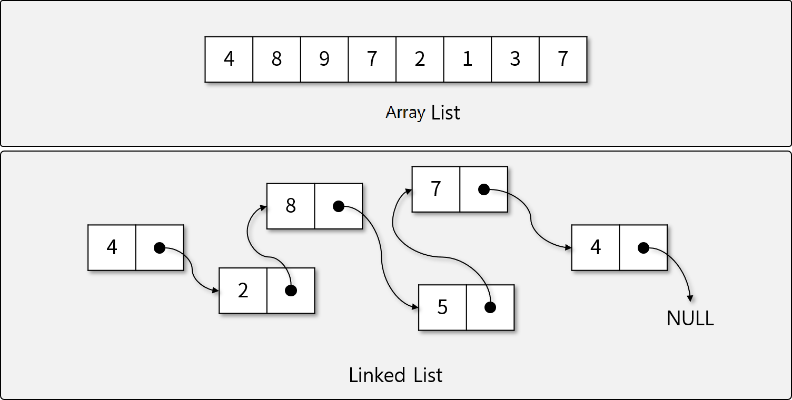

# Data Structures

## 학습 목표

- **자료구조**란 무엇인지 학습한다.
- 자료구조를 왜 알아야 하는지 이해한다.
- Python에 구현된 자료구조를 알아본다.

## 자료구조란

### 자료구조의 정의

- **자료(Data)**: 현실 세계로부터 수집한 사실이나 개념의 값 또는 이들의 집합. 특정 용도로 사용하기 위해 처리/가공한 것을 정보(Information)이라 한다.
- **자료구조(Data Structure)**: 자료구조는 자료 값의 모임, 자료 간의 관계, 그리고 자료에 적용할 수 있는 함수나 명령을 의미한다.

### 자료구조의 특징

- 효율성(Efficiency)
- 추상화(Abstraction)
- 재사용성(Reusability)

### 자료구조의 종류

- 크게 선형 자료구조와 비선형 자료구조로 나누어 볼 수 있다.

#### 선형 자료구조

- 선형 자료구조는 자료가 선형(1자)로 연결된 경우를 말한다.
- 선형으로 연결된 방법에 따라 분류할 수 있으며, Array와 Linked List 등을 기반으로 Stack, Queue 등을 만들어 사용한다.

#### 비선형 자료구조

- 선형으로 연결되지 않은 모든 자료 구조를 말한다.
- 비선형 구조를 **가장 일반적으로 표현하는 자료구조를 Graph**라 한다.
- Top Node와 Child Node들로 구성된 **Tree 구조**가 많이 사용된다.

## 자료구조의 필요성

- 프로그램에서는 다양한 자료를 임시(메모리)/영구적(파일시스템,데이터베이스)으로 저장하여 사용한다.
- 만능인 자료구조는 없다. 상황에 따라 적절한 자료구조를 선택하여 사용해야 한다.
- 자료구조의 선택(자료를 어떻게 저장할지)는 프로그램에 다음과 같은 중대한 영향을 끼친다.
  1. 필요한 자료에 **효율적으로 빠르게 접근**할 수 있게 한다.
  1. 자료의 중복을 최소화하여 **저장장치를 효율적으로 사용**할 수 있게 한다.
  1. 자료구조 별로 **적절한 알고리즘을 기계적으로 적용**할 수 있다.
  1. 동료들과 **협업**하는 데에 큰 도움이 된다. (잘못된 창의성을 발휘하지 않게 도와준다.)

## Python과 자료구조

- Python에는 대부분의 자료구조가 구현되어 있다. Reference를 참고하여 확인해 보자.
  - List
    - Queue(append, popleft), Stack(append, pop)
  - Map
    - Dictionary
  - Set
  - Heap
    - heap(List)
