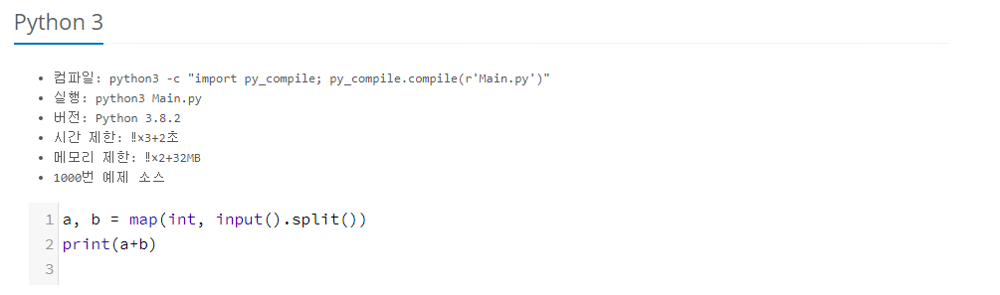
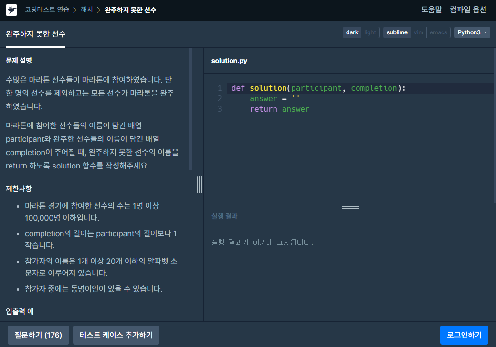

# 입력과 출력

- 입출력 방식은 플랫폼 별로 다를 수 있으며, 각 플랫폼에서 제시하는 방식을 이용하면 된다.
- 대표적인 입출력 예
  - 백준 온라인저지(input, print)

  <https://www.acmicpc.net/help/language>

  

  ```python
  a, b = map(int, input().split())
  print(a + b)
  ```

  ------------------------------------------------------------

  - Programmers(함수 입출력)

  <https://programmers.co.kr/learn/courses/30/lessons/42576?language=python3>

  
  
  ```python
  def solution(inputs):
      return output
  ```
