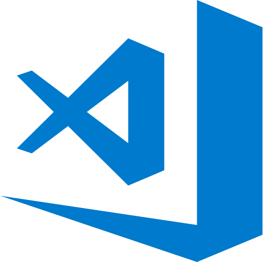

# 알고리즘 구현/테스트

## 테스트 입출력을 IDE에 구현해서 쓰면 좋은 이유

- 코딩테스트 페이지에서 직접 구현할 경우, 테스트/디버깅에 불리하다.
- 종종 페이지 오류로 소스코드를 날려버리는 경우도 생긴다...
- IDE를 사용하여 프로그래밍 속도를 향상하고, 실수를 줄일 수 있다.

## 입출력 구현

- IDE 내에서 모든 작업이 가능해지므로 손쉽게 결과를 확인 가능
- 디버깅 기능을 활용할 수 있어, 중간 결과를 확인하기 편리함
- 참조 소스코드
  - [파일 입출력 버전](src/fileio)
  - [함수 입출력 버전](src/functionio)

## 추천 IDE

- IntelliJ PyCharm
 </img>
  - 현업에서 많이 사용되는 Python 개발 툴
  - Community 버전은 무료이지만, 기능 제한이 많음 (웹 개발, 과학 도구, 원격 개발 미지원)
  - Professional 버전은 1년 구독에 $199
    - Fall-back license 적용 (구독 기간에 지원이 종료된 버전은 영구 사용 가능)

- VisualStudio Code
 </img>
  - 무료로 사용할 수 있는 오픈소스 Text Editor
  - 다양한 플러그인이 제공되어, 거의 모든 언어에 대한 IDE를 구성할 수 있음
  - 다양한 언어의 Linting, Build, Test 등 다양하게 활용 가능
    - 공식/비공식 Extension으로 지속적으로 개선 중
