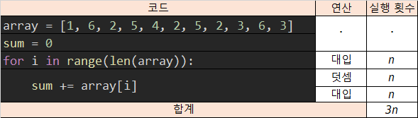
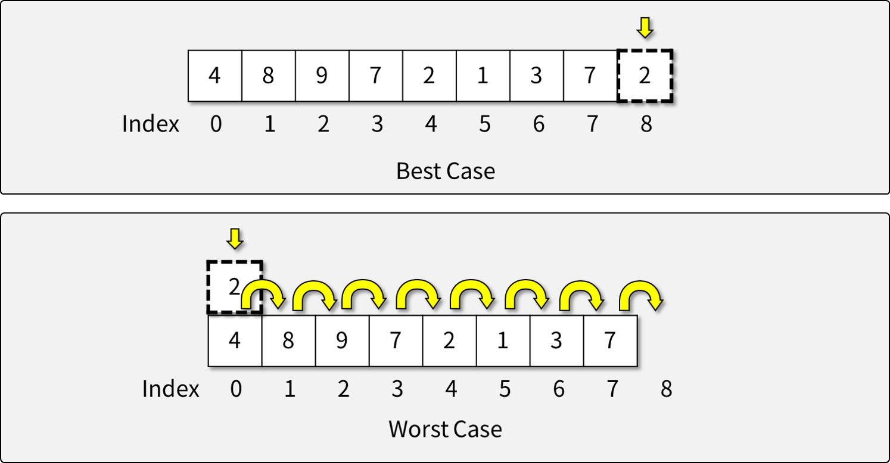
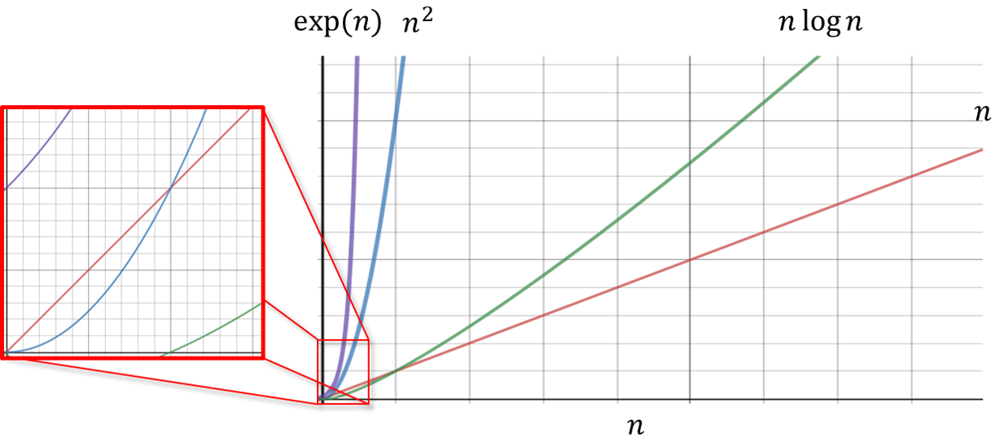
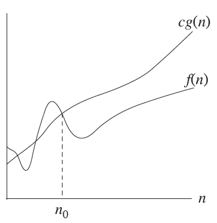
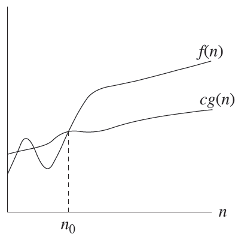
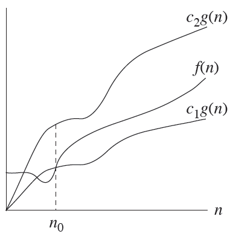

# 알고리즘의 복잡도

- 알고리즘이 복잡한 정도 (Complexity)는 크게 두 가지로 나누어 볼 수 있다.
  - 공간 복잡도 vs. 시간 복잡도 -> 일반적으로 두 복잡도는 Trade-off 관계가 있다.
- 알고리즘의 Complexity가 높을 수록 알고리즘을 구동하는 데에 더 많은 Cost가 소비된다.

## 공간 복잡도

- Space Complexity
- 알고리즘이 동작하기 위해 필요한 공간(메모리)의 크기
- 많은 경우, 연산의 중간 결과를 저장하기 위해 메모리를 소비한다.
  - 중간 결과를 저장하여 중복 연산을 줄일 수 있다.

## 시간 복잡도

- Time Complexity (계산 복잡도; Computational Complexity)
- 알고리즘이 동작하는 데에 걸리는 시간 또는 연산의 횟수

## 복잡도의 계산 방법

- 측정: 알고리즘을 구동하면서 Elementary Operation의 횟수를 카운팅하여 측정할 수 있다.

```python
count = 0
array = [1, 6, 2, 5, 4, 2, 5, 2, 3, 6, 3]

sum = 0
for i in range(len(array)): {
    count += 1 // 루프 조건 확인
    sum += array[i]
    count += 1 // 덧셈 연산
    count += 1 // 대입 연산
}
count += 1 // Branch
print(sum)

print(count)
```

- 분석: 반복문과 조건문을 고려하여 분기별로 실행 횟수를 분석을 통해 알아낼 수 있다.

</img>

## 복잡도의 종류

- 알고리즘 동작 상황에 따른 구분
  - **최악의 경우**
  - '최선의 경우'
  - '평균적인 경우'
- 일반적으로 **최악의 경우** 에 대해 알고리즘 복잡도를 정의한다.
  - ex) List에서의 Element Insertion

</img>

## Asymptotic Notations

</img>

- 점진적(asymptotic) 표기 방법
- 알고리즘에 입력되는 자료의 개수()가 충분히 많다고 가정
  - 입력 자료의 개수가 작은 경우, 비교하는 의미가 크게 없기 때문
- **성능 평가에 공평한 비교** 를 하기 위한 성능 분석 기준으로 사용
  - 동작 시스템, 데이터 크기 등을 배제하고 성능을 비교하기 위해 필요
- 상한, 하한, 상한과 하한의 교집합으로 정의

### Big-O Notation

</img>

- 복잡도 순위
  - %20%3C%20O(logn)%20%3C%20O(n)%20%3C%20O(nlogn)%20%3C%20O(n%5E2)%20%3C%20O(2%5En)%20%3C%20O(n!))
    - 상수, 로그, 선형, 선형로그, 다항식(제곱), 지수, 팩토리얼
- ) 의 Big-O Notation 정의:
  - )%20%3D%20%5C%7B%20f(n)%7C0%20%5Cle%20f(n)%20%5Cle%20c%20%5Ccdot%20g(n)%5Cspace%20%5Ctext%7Bfor%20all%7D%5Cspace%20%5Cspace%20n%20%5Cge%20n_0%20%3E%200%20%5C%7D%5Cspace%20%5Cspace%20%5Ctext%7Bfor%7D%20%5Cspace%20%5Cexists%20c%20%3E%200.)
- 예시
  - %5E2%20%5Cin%20O(n%5E2))
  - )
  - )
  - )
  - )

### Big-Omega  Notation

</img>

- ),  ), ) ...
- ) 의 Big-Omega Notation 정의:
  - )%20%3D%20%5C%7B%20f(n)%7C0%20%5Cle%20c%20%5Ccdot%20g(n)%20%5Cle%20f(n)%20%5Cspace%20%5Cspace%20%20%5Ctext%7Bfor%20all%7D%20%5Cspace%20n%20%5Cge%20n_0%20%3E%200%20%5C%7D%5Cspace%20%5Cspace%20%5Ctext%7Bfor%7D%20%5Cspace%20%5Cspace%20%5Cexists%20c%20%3E%200.)
- 예시
  - %5E2%20%5Cin%20%5Ctext{Ω}(n%5E2))
  - )
  - )
  - )
  - )

### Big-Theta Notation

</img>

- ),  ), ) ...
- ) 의 Big-Theta Notation 정의:
  - )%20%3D%20%5C%7B%20f(n)%7C0%20%5Cle%20c_1%20%5Ccdot%20g(n)%20%5Cle%20f(n)%20%5Cle%20c_2%20%5Ccdot%20g(n)%5Cspace%5Cspace%20%5Ctext%7Bfor%20all%7D%5Cspace%20n%20%5Cge%20n_0%20%3E%200%20%5C%7D%5Cspace%20%5Cspace%20%5Ctext%7Bfor%7D%5Cspace%20%5Cspace%20%5Cexists%20c_1%20%3E%200%2C%5Cspace%5Cexists%20c_2%20%3E%200.)
- 예시
  - %5E2%20%5Cin%20%5Ctext{Θ}(n%5E2))
  - )
  - )
  - )
