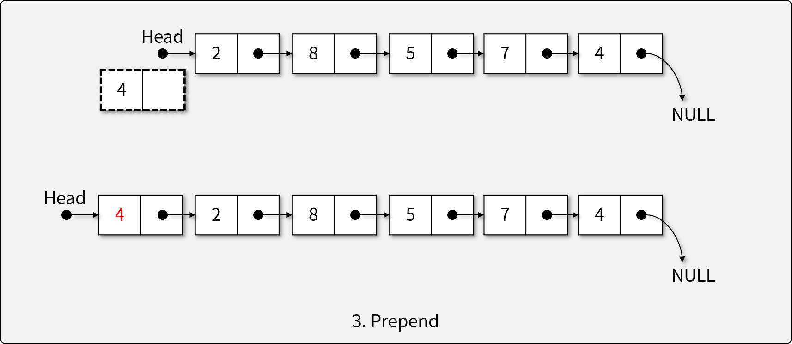
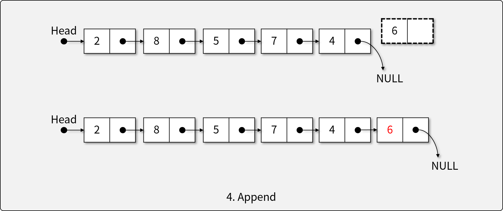
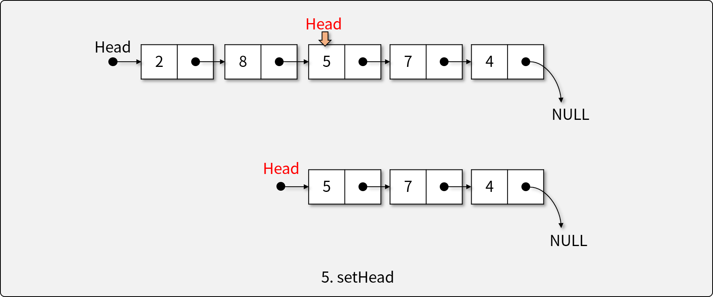
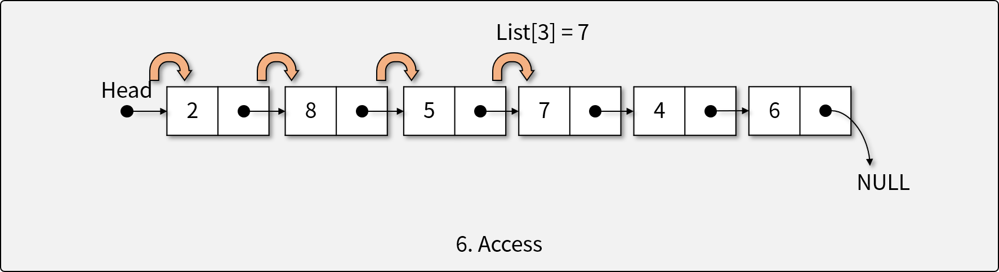
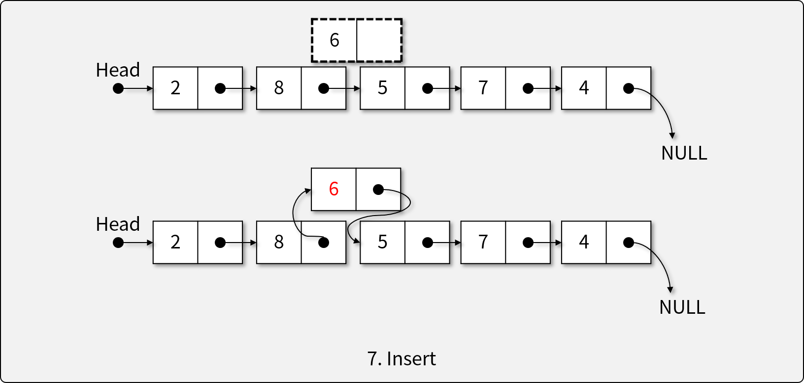
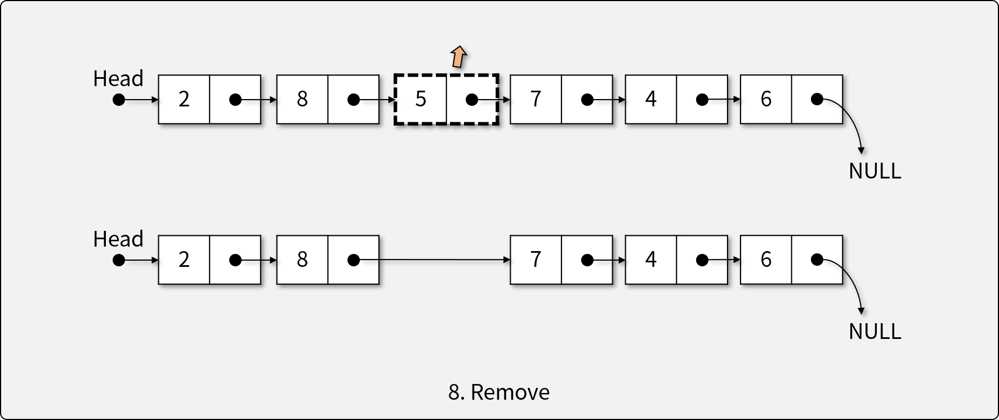
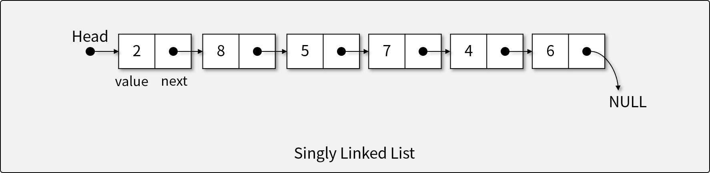
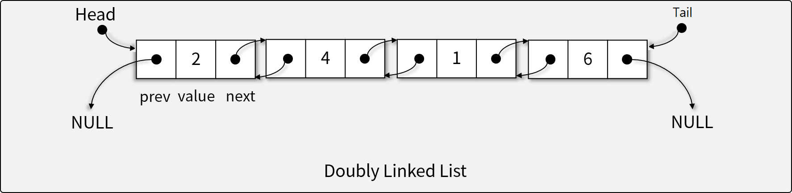

# 연결 리스트 (Linked List)

## 연결 리스트란

- 연결 리스트는 순서가 메모리 상의 물리적인 위치로 정의되지 않는 자료의 선형적 모임을 나타내는 **자료 구조**이다.
- 자료의 순서는 정해져 있으나, Array List와 달리 메모리상 연속성이 보장되지 않는다.
- 값과 포인터(또는 레퍼런스)를 가진 `Node`의 집합으로 구현한다.

## 리스트의 연산자

1. 비어있는 리스트를 생성하는 생성자

1. 리스트가 비어있는지 확인하는 연산자
1. 리스트의 앞에 개체를 삽입(prepending)하는 연산자

1. 리스트의 뒤에 개체를 삽입(appending)하는 연산자

1. 리스트의 첫 머리(head)를 결정하는 연산자

1. 주어진 인덱스에 해당하는 요소에 접근하는 연산자

1. 주어진 인덱스에 새로운 요소를 삽입하는 연산자

1. 주어진 인덱스에 해당하는 요소를 제거하는 연산자

## 연결 리스트의 구현

- 각 `Node`는 `value`와 연결된 다른 `Node`를 *가르키는* 연결(Link)로 구성
  - 연결 리스트에서 각 연산의 복잡도
    - `is_empty()`: O(1)
    - `prepend()`: O(1)
    - `append()`: O(n)
    - `set_head(index)`: O(n)
    - `access(index)`: O(n)
    - `insert(item, index)`: O(1) (w/o access)
    - `remove(index)`: O(1) (w/o access)

- **단방향 연결 리스트 (Singly Linked List)**

  - Head Node(첫 Element)를 시작으로 단방향으로 연결된 연결 리스트
    - 각 `Node`는 `value`와 `next` property를 지닌다.
  - 일자로 연결된 가장 간단한 형태의 연결 리스트이다.

- **양방향 연결 리스트 (Doubly Linked List)**

  - 단방향 연결 리스트에 `prev`를 포함시켜 양방향으로 연결된 연결 리스트
  - 이전 Node로 돌아갈 수 있어, insert와 remove 연산에 유리하다.

## [실습] Linked List 직접 구현하기

- Python의 `class`를 이용해 Singly Linked List 및 Doubly Linked List 직접 구현하기
- **구현 조건**
  - **단방향 연결 리스트 (Singly Linked List)**
    - `value`와 `next` property를 지닌 `Node` 클래스를 구현한다.
    - `Node`를 이용하여 Singly Linked List를 구현한다.
    - 다음과 같은 리스트 ADT의 연산자를 구현해야 한다.
      1. 비어있는 리스트를 생성하는 생성자
      1. 리스트가 비어있는지 확인하는 연산자
      1. 리스트의 앞에 개체를 삽입(prepending)하는 연산자
      1. 리스트의 뒤에 개체를 삽입(appending)하는 연산자
      1. 리스트의 첫 머리(head)를 결정하는 연산자
      1. 주어진 인덱스에 해당하는 요소에 접근하는 연산자
      1. 주어진 인덱스에 새로운 요소를 삽입하는 연산자
      1. 주어진 인덱스에 해당하는 요소를 제거하는 연산자
  - **양방향 연결 리스트 (Doubly Linked List)**
    - `value`, `next`, 그리고 `prev` property를 지닌 `Node` 클래스를 구현한다.
    - `Node`를 이용하여 Doubly Linked List를 구현한다.
    - 다음과 같은 리스트 ADT의 연산자를 구현해야 한다.
      1. 비어있는 리스트를 생성하는 생성자
      1. 리스트가 비어있는지 확인하는 연산자
      1. 리스트의 앞에 개체를 삽입(prepending)하는 연산자
      1. 리스트의 뒤에 개체를 삽입(appending)하는 연산자
      1. 리스트의 첫 머리(head)를 결정하는 연산자
      1. 주어진 인덱스에 해당하는 요소에 접근하는 연산자
      1. 주어진 인덱스에 새로운 요소를 삽입하는 연산자
      1. 주어진 인덱스에 해당하는 요소를 제거하는 연산자
- **참조 코드**
  - 단방향 연결 리스트
    - [기반 소스 코드](src/SLL/before.py)
    - [솔루션 코드](src/SLL/after.py)
  - 양방향 연결 리스트
    - [기반 소스 코드](src/DLL/before.py)
    - [솔루션 코드](src/DLL/after.py)
