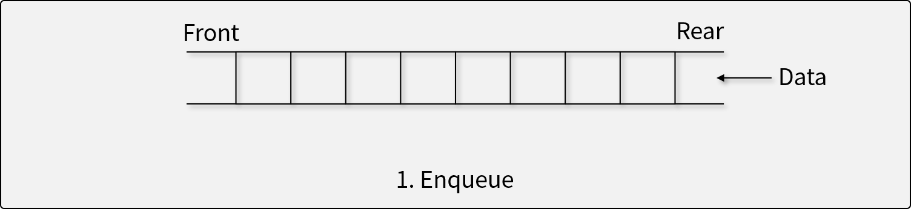
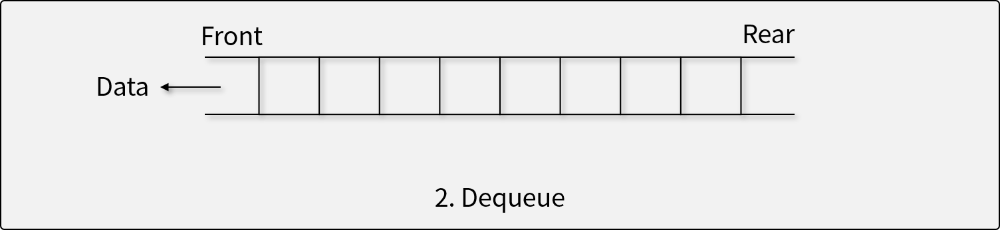
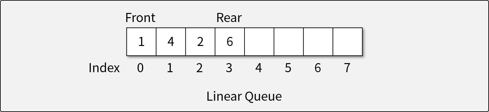
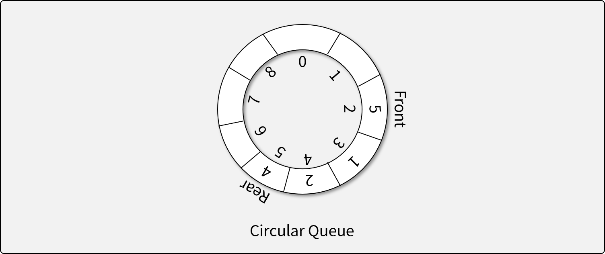

# 큐 (Queue)

## 큐란

- 큐는 선입선출(First In First Out; FIFO)의 특성을 가지는 **추상 자료형**이다.
- 입력된 데이터가 순서대로 처리되어야 할 때 사용한다. (First Come, First Served.)

## 큐의 연산자

1. 자료를 Rear로 삽입하는 연산자 (Put, Enqueue)

  더 이상 삽입할 수 없는 경우 *오버플로우* 발생
1. 자료를 Front에서 꺼내는 연산자 (Get, Dequeue)

  더 이상 꺼낼 수 없는 경우 *언더플로우* 발생
1. Front에 있는 자료를 반환하지만, 삭제하지는 않는 연산자 (Peek)

## 큐의 구현

- **선형 큐 (Linear Queue)**

  - Rear와 Front가 일직선으로 전진하는 구조.
  - 한 번 사용한 메모리 공간이 버려지는 문제가 있다.
    - 모든 요소를 앞으로 당겨주지 않으면 필연적으로 Overflow가 발생
- **환형 큐 (Circular Queue)**

  - 선형 큐의 끝 부분을 서로 연결하는 구조.
  - 한 번 사용한 메모리도 다시 활용할 수 있다.
    - 큐의 용량을 모두 사용하기 전에는 Overflow가 발생하지 않음
- **연결리스트 큐 (Linked Queue)**

  - 연결 리스트를 이용해 큐 구성
  - 물리적인 메모리를 모두 사용하기 전까지 Overflow가 발생하지 않음

## [실습] 선형 큐, 환형 큐, 연결리스트 큐 구현하기

- Python의 array.array와 연결 리스트를 이용해 직접 구현하기
- **구현 조건**
  - `class`와 `array.array`, 그리고 `LinkedList`를 이용하여 선형 큐, 환형 큐, 연결리스트 큐를 구현한다.
  - `array.array`의 용량(capacity)은 고정되어 있다고 가정한다.
    - 배열의 크기가 부족하면 *오버플로우*가 발생한다.
    - 연결리스트 큐는 오버플로우가 발생하지 않는다.
  - 다음과 같은 큐 ADT의 연산자를 구현해야 한다.
    1. 자료를 Rear로 삽입하는 연산자 (Put, Enqueue)
      더 이상 삽입할 수 없는 경우 *오버플로우* 발생
    1. 자료를 Front에서 꺼내는 연산자 (Get, Dequeue)
      더 이상 꺼낼 수 없는 경우 *언더플로우* 발생
    1. Front에 있는 자료를 반환하지만, 삭제하지는 않는 연산자 (Peek)

- **참조 코드**
  - 선형 큐
    - [기반 소스 코드](src/linearQ/before.py)
    - [솔루션 코드](src/linearQ/after.py)
  - 환형 큐
    - [기반 소스 코드](src/circularQ/before.py)
    - [솔루션 코드](src/circularQ/after.py)
  - 연결리스트 큐
    - [기반 소스 코드](src/linkedQ/before.py)
    - [솔루션 코드](src/linkedQ/after.py)
