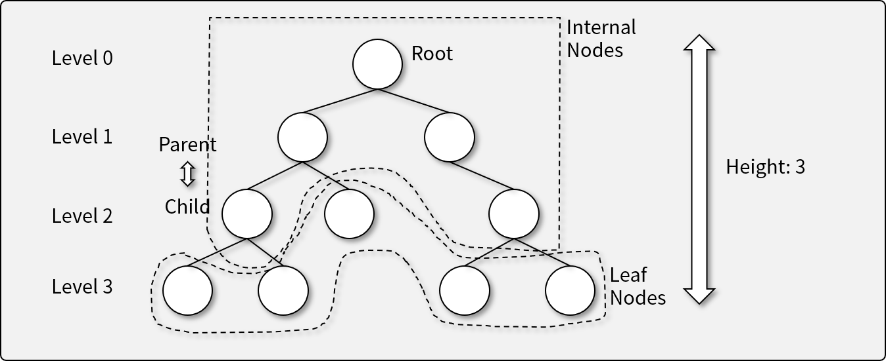
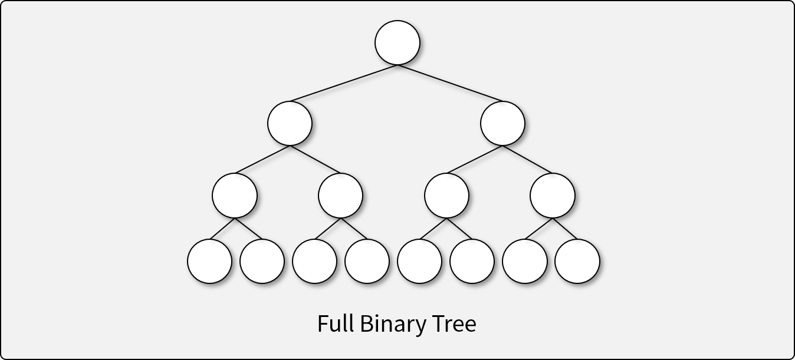
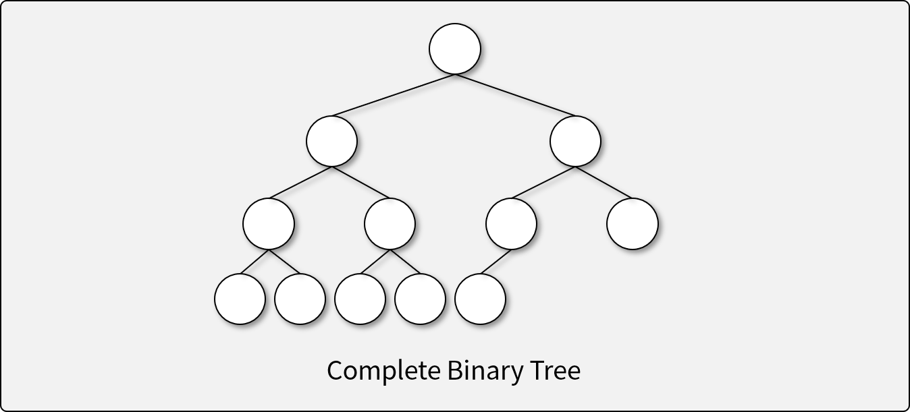
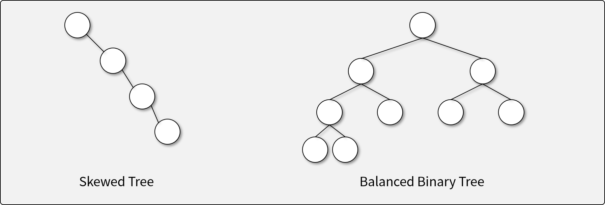
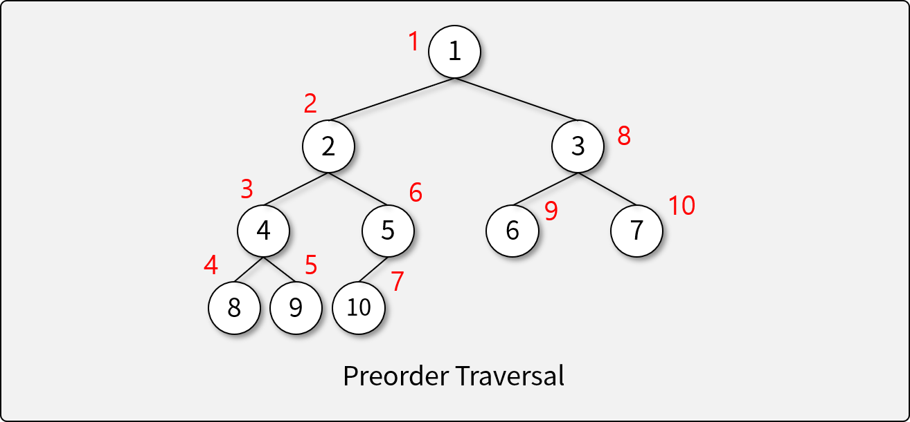
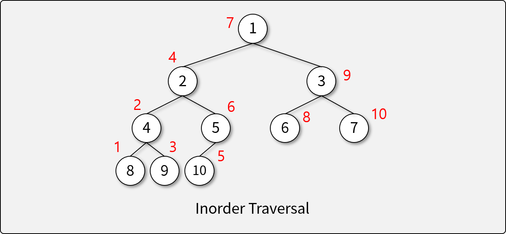
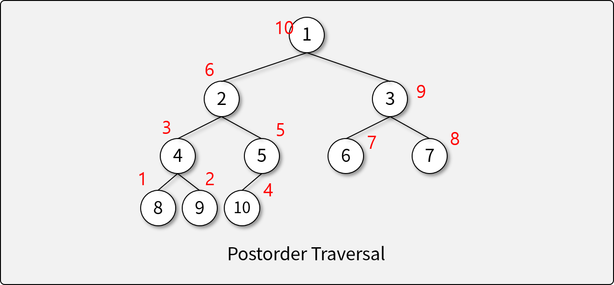
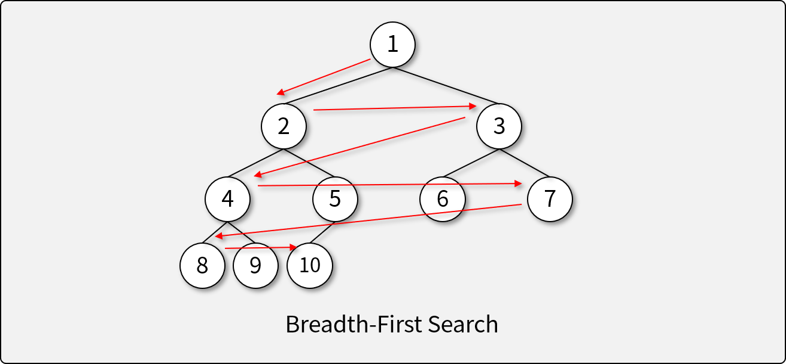
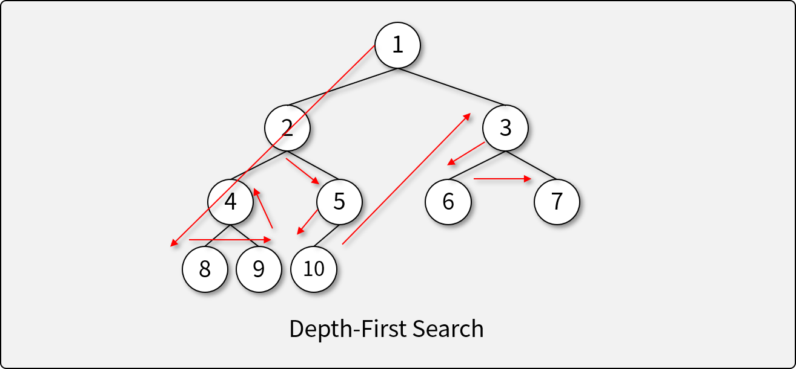
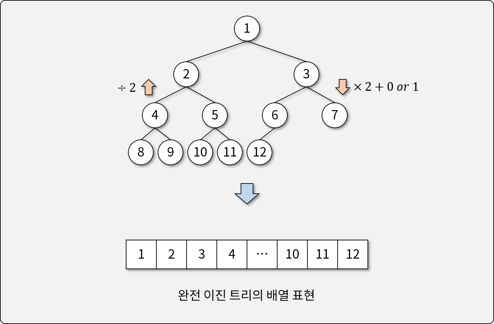

# Tree

## 트리란

- 그래프의 일종으로, 여러 노드가 한 노드를 가르킬 수 없는 구조
- 회로(Cycle)이 없고, 두 노드를 잇는 길이 하나뿐인 그래프

## 트리의 구조

- 루트(Root): 부모가 없는, 가장 상윗단의 노드
- 노드(Node): 트리 구조의 자료 값을 담고 있는 요소
- 에지(Edge): 노드 간의 연결선
- 부모(Parent): 연결된 두 노드 중 더 상위에 있는 노드
- 자식(Child): 연결된 두 노드 중 하위에 있는 노드
- 경로(Path): 두 노드를 연결하는 에지의 시퀀스
- 잎새 노드(Leaf Node): 자식 노드가 없는 노드
- 내부 노드(Internal Node): 잎새 노드를 제외한 모든 노드
- 레벨, 깊이(Level, Depth): 루트 노드로부터의 경로의 길이
- 트리의 높이(Height): 트리에서 가장 큰 레벨 값

## 트리의 특징

- 하나의 노드에서 다른 노드로 이동하는 경로는 유일
- Acyclic하다. (Cycle이 존재하지 않는다)
- 모든 노드는 서로 연결되어 있다. (외딴 섬이 존재하지 않는다.)
- 하나의 Edge를 끊으면 두개의 Sub-Tree로 분리된다.
- Edge의 수는 [Node의 수 - 1]이다.

## 이진 트리 (Binary Tree)

### 이진 트리의 종류

- 정 이진 트리 (Full Binary Tree, Perfect Binary Tree)

- 완전 이진 트리 (Complete Binary Tree)

- 균형 이진 트리 (Balanced Binary Tree)

### 이진 트리의 순회 (Traversal)

- 깊이 우선 순회 (Preorder, Depth-First Traversal) (`node` -> `left` -> `right`)

- 대칭 순회 (Inorder, Symmetric Traversal) (`left` -> `node` -> `right`)

- 후위 순회 (Postorder) (`left` -> `right` -> `node`)

### 이진 트리의 탐색 (Search)

- 너비 우선 탐색 (Breadth-First Search; BFS)

- 깊이 우선 탐색 (Depth-First Search; DFS)

## 완전 이진 트리의 구현

- 배열을 이용한 구현
  - 배열에 너비 우선 탐색 순서대로 값을 삽입

- 노드를 이용한 구현
  - `value`, `left`, `right`를 가진 `node class`를 이용하여 구현

## [실습] 배열 기반 완전 이진 트리 구현하기

- Python의 `array.array`와 `class`를 이용해 직접 구현하기
- **구현 조건**
  - `class`와 `array.array`를 이용하여 완전 이진 트리를 구현한다.
  - 데이터는 생성자에서 배열로 입력받는다.
  - 다음과 같은 트리의 연산을 구현해야 한다. (*자료의 입력과 삭제는 구현하지 않는다.*)
    - 순회 알고리즘: 순회하는 순서대로 Element를 출력한다.
      1. 깊이 우선 순회 (Preorder, Depth-First Traversal)
      1. 대칭 순회 (Inorder, Symmetric Traversal)
      1. 후위 순회 (Postorder)
    - 탐색 알고리즘: 탐색하여 Tree에 해당 `value`의 존재 여부를 판단한다.
      1. 너비 우선 탐색 (Breadth-First Search; BFS)
      1. 깊이 우선 탐색 (Depth-First Search; DFS)

- **참조 코드**
  - [기반 소스 코드](src/array/before.py)
  - [솔루션 코드](src/array/after.py)

## [실습] 노드 기반 완전 이진 트리 구현하기

- Python의 `class`를 이용해 직접 구현하기
- **구현 조건**
  - `value`, `left`, `right`를 가진 `node class`를 이용하여 구현한다.
  - 데이터는 생성자에서 배열로 입력받는다.
  - 다음과 같은 트리의 연산을 구현해야 한다. (*자료의 입력과 삭제는 구현하지 않는다.*)
    - 순회 알고리즘: 순회하는 순서대로 Element를 출력한다.
      1. 깊이 우선 순회 (Preorder, Depth-First Traversal)
      1. 대칭 순회 (Inorder, Symmetric Traversal)
      1. 후위 순회 (Postorder)
    - 탐색 알고리즘: 탐색하여 Tree에 해당 `value`의 존재 여부를 판단한다.
      1. 너비 우선 탐색 (Breadth-First Search; BFS)
      1. 깊이 우선 탐색 (Depth-First Search; DFS)

- **참조 코드**
  - [기반 소스 코드](src/node/before.py)
  - [솔루션 코드](src/node/after.py)
