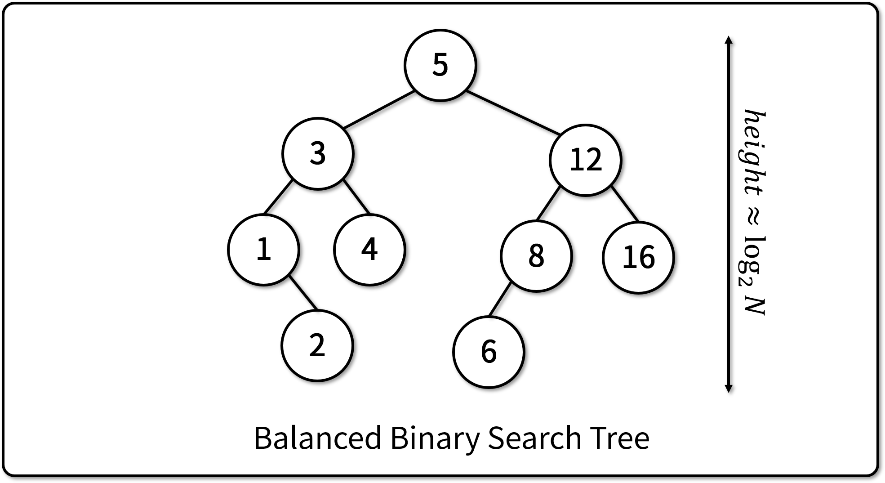

# 이진 탐색 트리 (Binary Search Trees)

## 이진 탐색 트리란

- 노드의 값에 '순서' 또는 '크고 작음'이 있다.
- 노드의 왼쪽 서브트리는, 그 노드의 값보다 작은 값을 가진 노드로 이루어져 있다.
- 노드의 오른쪽 서브 트리는, 그 노드의 값보다 큰 값을 가진 노드로 이루어져 있다.

## 이진 탐색 트리의 특징

- 이진 탐색 트리의 구조는 자료를 넣는 순서에 영향을 받는다.
- 밸런스가 잘 맞는 경우 아래 시간복잡도를 가진다.
  - 자료의 탐색: O(logN)
  - 자료의 삽입: O(logN)
  - 자료의 삭제: O(logN)
- 자료의 중복이 허용되지 않는다.

## 이진 탐색 트리의 한계

- Skewed Tree가 될 경우, 성능이 하락한다.
- 최악의 경우 아래 시간복잡도를 가진다.
  - 자료의 탐색: O(N)
  - 자료의 삽입: O(N)
  - 자료의 삭제: O(N)

## 자료의 탐색

- 루트 노드에서부터 탐색을 시작한다.
- 찾고자 하는 값이 노드의 값보다 작으면 왼쪽으로 이동한다.
- 찾고자 하는 값이 노드의 값보다 크면 오른쪽으로 이동한다.

## 자료의 삽입

- 자료를 탐색한다.
  - 일치하는 노드가 발견되면 삽입을 종료한다.
  - 일치하는 노드가 없으면, 마지막 노드의 좌/우에 자료를 삽입한다.

## 자료의 삭제

- (a) 자식 노드가 없는 노드는 단순히 삭제한다.
- (b) 자식이 하나만 있으면, 자식 노드로 대체한다.
- (c) 두 자식이 모두 있는 경우, 두가지 방법 중 선택하여 동작시킨다.
  - 왼쪽 Sub-Tree에서 가장 오른쪽에 있는 노드로 대체한다.
  - 오른쪽 Sub-Tree에서 가장 왼쪽에 있는 노드로 대체한다.

## [실습] 이진 탐색 트리 구현하기

- **참조 코드**
  - [기반 소스 코드](src/before.py)
  - [솔루션 코드](src/after.py)
