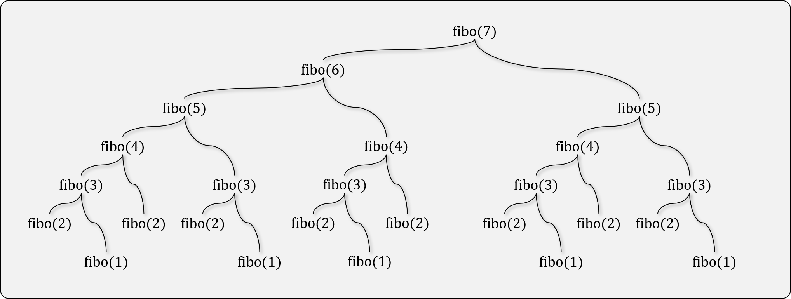

# 재귀 호출과 반복 (Recursive Calls & Iterations)

## 재귀 호출이란

- 함수가 자기 자신을 호출하는 것을 재귀 호출이라 한다.
- 분할 정복(Divide & Conquer), 점화식 등을 구현하는 데에 많이 사용된다.
- 재귀 구현은 항상 반복(Iteration) 구현으로 변환될 수 있다.

## 점화식

- 재귀식(Recursion relation)이라고도 부르며, 수열의 항 사이의 관계를 나타낸다.
- 일부 점화식은 일반식으로 풀이할 수 있다. 수열을 n에 대한 식으로 표현하는 것을 '풀이한다'고 한다.
- 점화식의 예
  - 피보나치 수열: f(n) = f(n-1) + f(n-2)
  - 팩토리얼: f(n) = n * f(n-1)
  - 등차 수열: f(n) - f(n-1) = d
  - 등비 수열: f(n) / f(n-1) = r

## 재귀 호출

- 재귀 호출을 할 때에는 반드시 '탈출 조건'이 필요하다.
  - 탈출 조건이 없으면, 재귀 호출은 무한히 계속된다.
- 점화식에 의거하여 재귀 호출을 수행한다.
  - 입력 파라미터를 달리하여, 결국 탈출 조건에 도달할 수 있게 한다.

```python
def fibonacci(n):
    if n < 2: # 탈출 조건
        return n
    return fibonacci(n-1) + fibonacci(n-2) # 재귀 호출(점화식 구현)
```

## 분할 정복

- 재귀 호출을 이용하여 큰 문제를 작은 문제로 나누어 해결
  - 재귀 호출을 이용해 Top-Down 형식으로 구현

```python
def quick_sort(x):
    if len(x) < 2: # 종료 조건
        return x

    left = []
    right = []
    pivot = x[len(x) // 2]

    for el in x:
        if el < pivot:
            left.append(el)
        else:
            right.append(el)
    
    return quick_sort(left) + [pivot] + quick_sort(right) # 분할 정복
```

## 재귀 호출의 한계



- 여러번 재귀 호출이 발생하는 경우, 기하급수적으로 호출 횟수가 증가한다.
  - 함수 호출 스택(Function call stack)의 크기에 제한이 있어, 일정 횟수 이상 호출이 불가하다.
- 실질적인 계산에 필요한 연산보다, 함수 호출에 의한 Overhead가 발생한다.

## 반복 구현

- 종료 조건을 초기값(initial value)으로 하여, Bottom-Up으로 구현한다.

```python
def fibonacci(n):
    fn_1, fn = 0, 1  # 초기값 설정
    
    if n == 0:
        return fn_1
    if n == 1:
        return fn
    
    for i in range(2, n + 1):  # 반복문 구현
        fn_1, fn = fn, fn_1 + fn 
    
    return fn
```

## Tail Recursion

- 재귀 함수에서, 재귀 호출이 마지막에 단 한번 수행되는 것을 의미한다.
- 재귀 호출이 여러번 발생하는 경우, Tail Recursion 기법으로 재귀 횟수를 줄일 수 있다.
- 컴파일러에서 Tail Recursion 최적화를 지원하는 경우, 함수 호출 스택을 낭비하지 않을 수 있다.
  - 재귀 호출 이후에는 함수에서 할 일이 남아있지 않으므로, 함수 호출 스택을 재활용한다.
  - 컴파일러에서 최적화를 지원하지 않으면 적용되지 않는다. (Python은 미지원)

```python
def fibonacci(n, a=0, b=1):
    if n == 0:
        return a
    if n == 1:
        return b
    
    return fibonacci(n-1, b, a+b)
```

## [실습] 하노이의 탑

- [프로그래머스 하노이의 탑](https://programmers.co.kr/learn/courses/30/lessons/12946)

## [실습] 괄호 변환 문제

- [프로그래머스 카카오 BLIND 2020 괄호 변환 문제](https://programmers.co.kr/learn/courses/30/lessons/60058)
