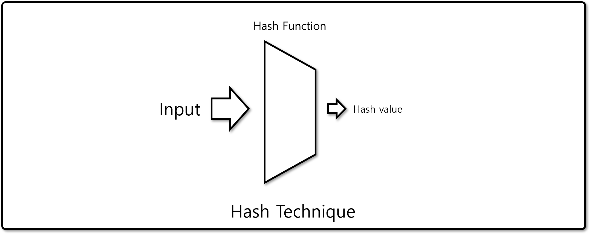
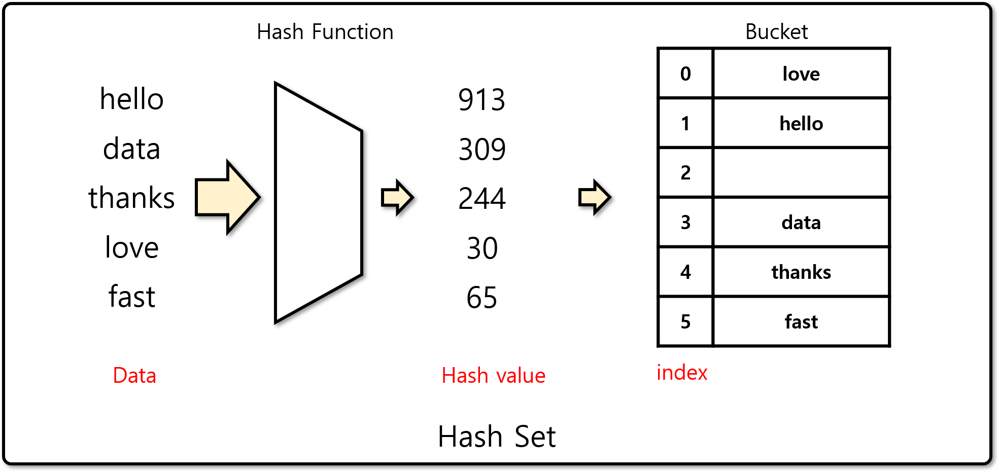
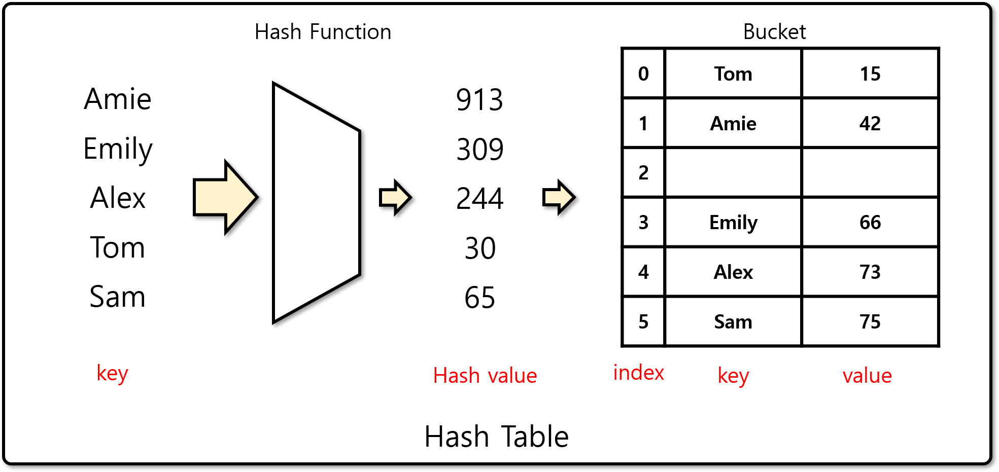
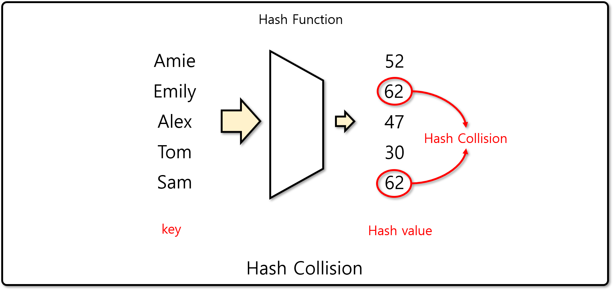
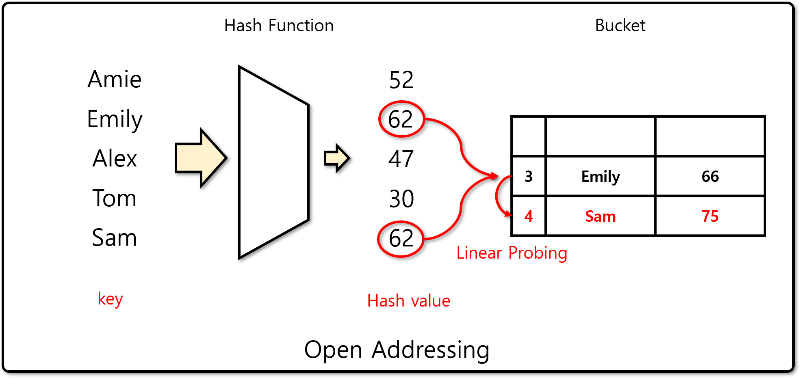
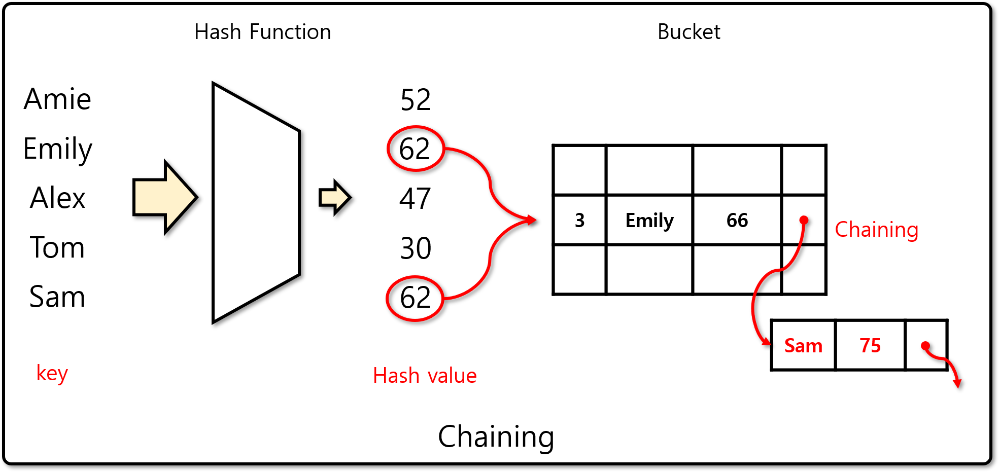

# 해싱 (Hashing)

## 해시 기법이란

- 빠르게 계산할 수 있는 해시 함수(Hash Function)을 이용해 해시값으로 변환하는 기법
  - 일반적으로 입력의 범위보다 해시값의 범위는 감소한다.
- 해시 함수는 동일 입력에 대해서 동일 출력을 보장한다.
  - 다른 입력에 대해서 동일 출력이 발생할 수 있으며, 이것을 해시 충돌(Hash Collision)이라 한다.
- 해시 함수의 선택에 따라 성능의 차이가 발생한다.
  - 해시 함수를 계산하는 데에 걸리는 시간에 크게 성능이 영향을 받는다.
  - 해시 충돌의 발생 확률에 따라 성능이 크게 영향을 받는다.

## 해시 셋 (Hash Set)

- 집합을 구현하는 대표적인 자료구조. 파이썬에서는 set 자료형으로 구현되어 있다.
  - 해시값을 인덱스로 하여 배열(Bucket)에 자료를 저장하는 자료구조이다.
    - 자료를 저장하는 인덱스는 `index = hash_value % bucket_size`로 정한다.
  - 자료의 중복을 허용하지 않으며, 빠르게 자료를 탐색할 수 있다.
  - 해시 충돌이 발생할 경우 Chaining이나 Open Addressing 기법으로 처리한다.

## 해시 테이블 (Hash Table)

- key와 value의 쌍을 저장하는 자료구조로. 파이썬에는 dictionary 자료형으로 구현되어 있다.
  - key의 해시값을 인덱스로 하여, 배열(Hash Table)에 key와 value를 저장하는 자료구조이다.
    - 자료를 저장하는 인덱스는 `index = hash_value % bucket_size`로 정한다.
  - key는 중복이 허용되지 않으나, value는 중복이 허용된다.

## 해시 충돌 (Hash Collision)

- 서로 다른 입력 값에 대해서 해시 함수가 동일 출력을 내는 경우를 말한다.
- 모든 해시값에서 해시 충돌이 발생하는 경우 탐색 성능이 O(N)으로 하락한다.

## 해시 충돌의 해결

### 개방 주소법 (Open Addressing)

- 폐쇄 해싱(Closed Hashing)이라고도 부르며, 배열의 다른 index를 선택하여 해시 충돌을 해결하는 방법
- 개방 주소법은 더이상 해시 충돌이 발생하지 않을 때 까지 반복하여 사용한다.
- 개방 주소법의 종류
  - 선형 탐사 (Linear Probing): 정해진 값만큼 index를 이동하는 방법. 보통 1을 사용한다.
  - 이차 탐사 (Quadratic Probing): index를 제곱한 값으로 이동하는 방법
  - 이중 해싱 (Double Hashing): 별도의 해시 함수를 이용해 이동 간격을 결정하는 방법

### 체이닝 (Chaining)

- 해시 충돌이 발생할 경우 링크드 리스트에 노드를 추가하는 방법으로 해결하는 방법
  - 배열에 값을 저장하는 대신, 링크드 리스트를 저장한다.

## [실습] 해시 테이블 구현하기

- 개방 주소법 또는 체이닝 기법을 이용하여 해시 테이블을 구현한다.
- 해시 함수 및 버킷의 크기는 외부에서 입력받을 수 있도록 한다.
  - 기본 해시 함수는 built-in hash 함수를 사용한다.
- 참고 소스코드
  - [기반 코드](src/before.py)
  - [솔루션 코드](src/after.py)

## [실습] 해시 테이블 문제

- [프로그래머스 베스트앨범 문제](https://programmers.co.kr/learn/courses/30/lessons/42579)
