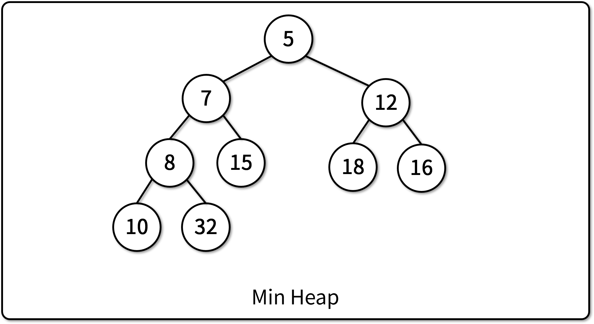
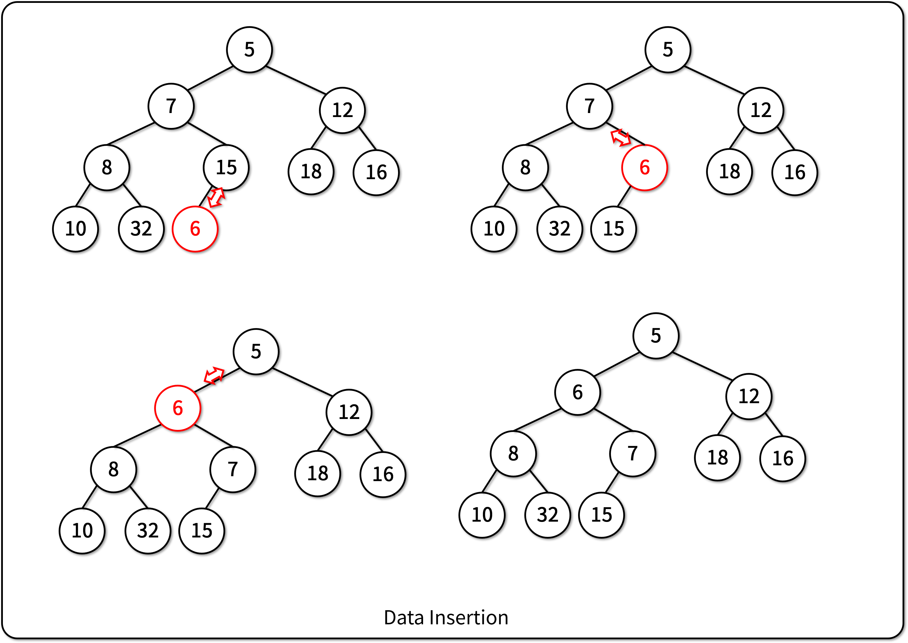
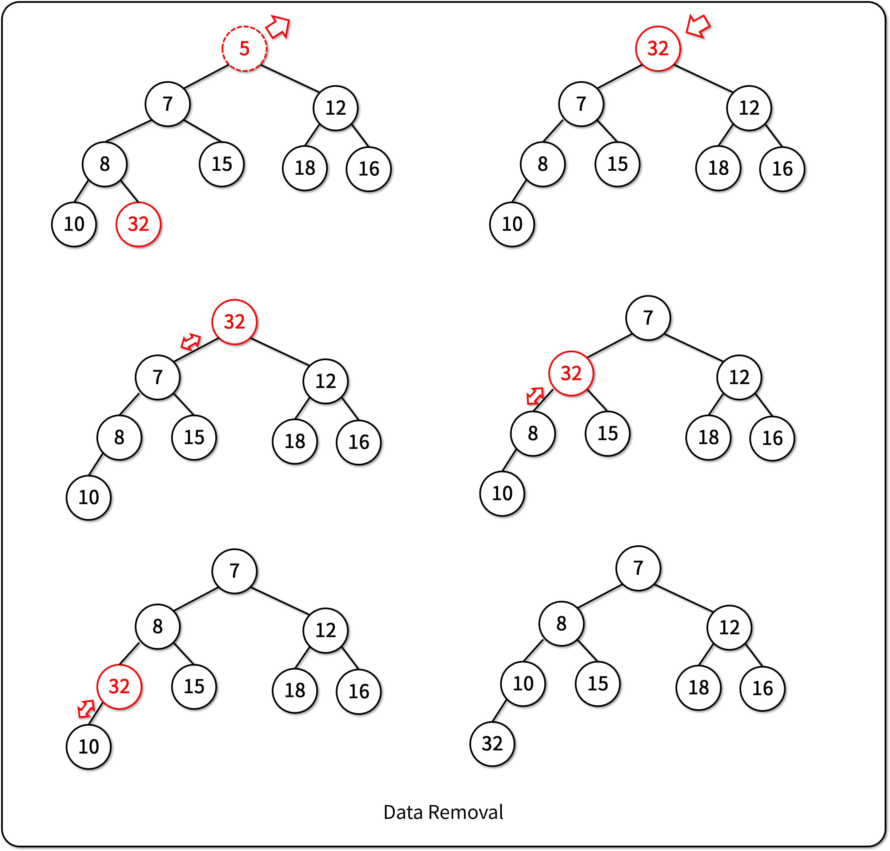

# Heap

## Heap이란

- 항상 최대값/최소값이 루트 노드에 존재하는 트리 구조
- 우선순위 큐(Priority Queue)를 구현하는 데에 쓰인다.
- 자료를 트리에서 제거하거나 추가할 때 이를 위한 추가 동작을 구현
- 배열로 이루어진 **완전 이진 트리(CBT)**를 기반으로 함

## Max Heap/Min Heap의 정의



- Min Heap: 부모 노드가 항상 자식 노드보다 작은 완전 이진 트리
- Max Heap: 부모 노드가 항상 자식 노드보다 큰 완전 이진 트리

## Heap에 자료 입력하기



1. 배열의 마지막에 새로운 자료를 추가
2. 부모 노드와 비교하여 두 값을 swap해야 하는지 여부 결정
3. Heap의 정의에 부합할 때 까지 2번 동작을 반복 (최대 O(logN)번 반복)

## Heap에서 자료 삭제하기



1. 항상 루트(배열의 첫번째 자료)의 자료를 삭제한다.
2. 배열의 마지막 자료를 첫번째 위치로 옮긴다.
3. 두개의 자식 노드 중 부모의 자리를 대체할 노드를 선택
4. Heap의 정의에 부합할 때 까지 3번 동작을 반복 (최대 O(logN)번 반복)

## Heap의 장점

- 일반 배열에서 최대값/최소값을 찾아 반환하는 연산: O(N)
- 정렬된 배열에서 최대값/최소값을 찾아 반환하는 연산: O(1) (단, 정렬하는 연산 O(NlogN))
  - 배열에 새로운 자료를 추가하는 연산: O(N)
- Heap에서 최대값/최소값을 찾아 반환하는 연산: O(logN)
  - Heap에 최대값/최소값을 추가하는 연산: O(logN)

## Python에 구현된 Heap

- heapq 내장 모듈에 Min Heap 기능이 포함되어 있다.

```python
import heapq

heap = [] # 힙으로 사용할 리스트 생성
heapq.heappush(heap, 2) # 힙에 자료 입력
heapq.heappush(heap, 1)
heapq.heappush(heap, 5)

print(heapq.heappop(heap)) # 1 힙에서 최소값 추출 (Min heap으로 동작)
print(heapq.heappop(heap)) # 2
print(heapq.heappop(heap)) # 5
```

- Max Heap으로 사용하고자 할 경우, 자료를 입력할 때 튜플로 우선순위를 추가한다.
  - (우선순위, value)로  구현

```python
import heapq

heap = [] # 힙으로 사용할 리스트 생성
heapq.heappush(heap, (-2, 2)) # 힙에 자료 입력 (-val, val)으로 우선순위를 추가
heapq.heappush(heap, (-1, 1))
heapq.heappush(heap, (-5, 5))

print(heapq.heappop(heap)[1]) # 5 힙에서 최소값 추출 (Max heap으로 동작)
print(heapq.heappop(heap)[1]) # 2
print(heapq.heappop(heap)[1]) # 1
```

## Heap 자료구조의 구현

- [기반 소스 코드](src/before.py)
- [솔루션 코드](src/after.py)
