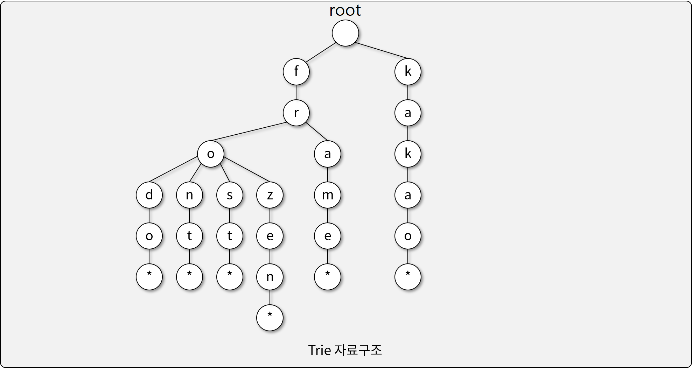
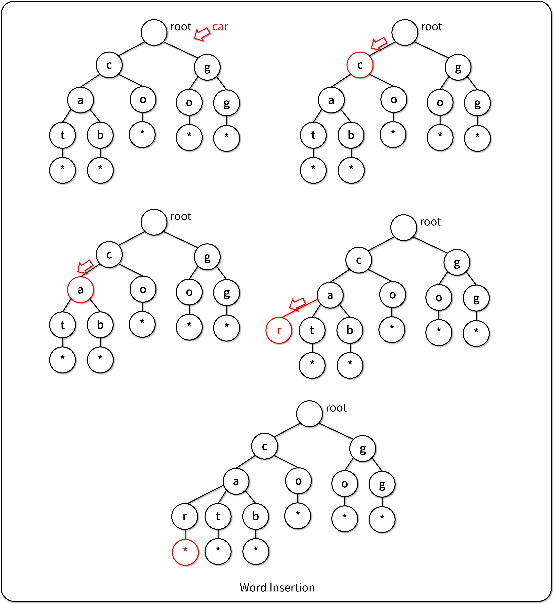
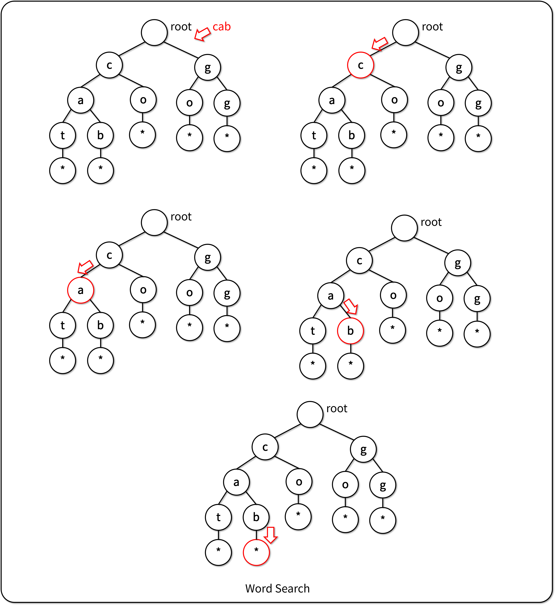

# Trie (Retrieval Tree)

## Trie 자료구조

- 단어 검색에 최적화된 Tree 기반의 자료구조
  - Trie 이름의 어원: Re**trie**val
- Trie에서 단어 검색의 시간 복잡도: `O(M)`, `M`: 단어의 길이
  - cf) 단순 문자열 비교의 시간 복잡도: `O(N*M)`, `N`: 단어의 개수

## Trie에 자료 입력하기

- 자식 노드에 다음 문자가 있으면, 해당 노드로 이동한다.
- 자식 노드에 다음 문자가 없으면, 노드를 생성한다.
- 더이상 문자가 없으면, 종료 문자(\*)를 리프노드로 입력한다.

## Trie에서 자료 검색하기

- 자식 노드에 다음 문자가 있으면, 해당 노드로 이동한다.
- 자식 노드에 다음 문자가 없으면, 검색을 종료한다.
- 더이상 문자가 없으면, 종료 문자(\*)를 가진 리프노드가 있는지 확인한다.

## [실습] 가사 검색 문제

- [카카오 BLIND 가사 검색 문제](https://programmers.co.kr/learn/courses/30/lessons/60060)
