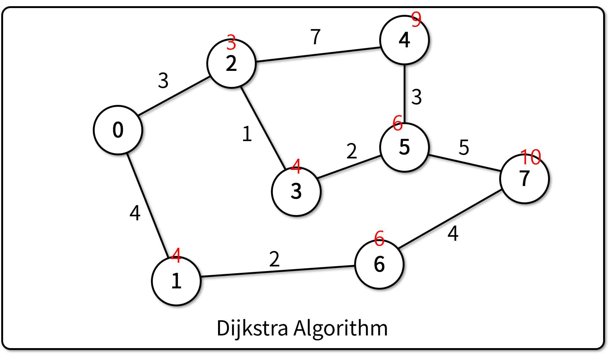
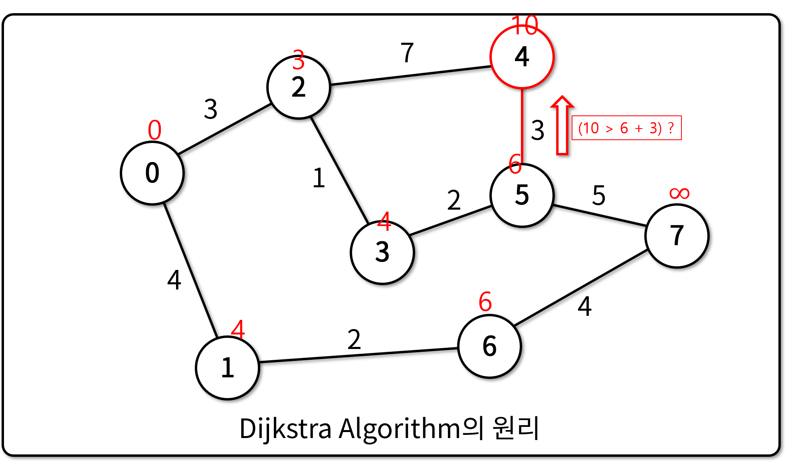
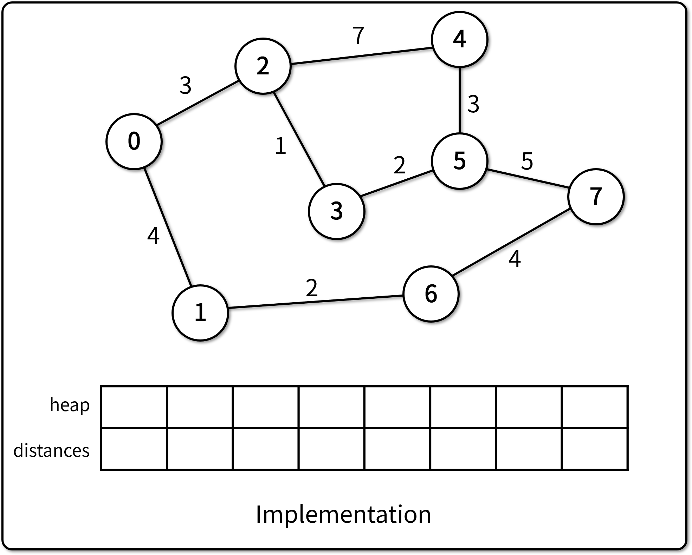

# Dijkstra 알고리즘

## Dijkstra 알고리즘의 정의



- Dijkstra 알고리즘은 노드 하나를 기준으로 다른 모든 노드까지 도달하는 최단 거리를 계산하는 알고리즘이다.
  - Vanila Dijkstra 알고리즘은 최단 거리만을 계산하며, 경로까지 알아내려면 추가 메모리 필요

- Dijkstra 알고리즘을 적용하기 위해서는 아래 조건을 만족해야 한다.
  - 그래프의 내 간선(edge) 중 음수 값이 없을 때에 사용 가능
  - 그래프는 유향 그래프 또는 무향 그래프 모두 사용 가능

## Dijkstra 알고리즘의 원리



- Greed Algorithm이면서, Dynamic Programming 기법을 사용한다.
  - 가장 가중치가 작은 간선부터 하나씩 탐색 (Greed Algorithm)
  - 탐색 과정에서 **최단 거리를 기억**하여, 이를 누적하여 빠르게 최단 거리 계산 (Dynamic Programming)

## Dijkstra 알고리즘의 구현



- 각 Node에 도달하는 최소 거리를 기억하기 위한 배열 `distance`를 생성하고, 무한대 값으로 초기화
- **Start Node에서 해당 Node까지의 거리를 정렬 기준**으로 하는 Min Heap 생성
- Start Node를 Min Heap에 삽입 (자기 자신까지의 거리는 0)
- Min Heap에 Node가 있는 동안 반복
  - Min Heap에서 Node를 하나 꺼낸다.
  - Min Heap에 기록된 거리가 distance에 저장된 해당 Node까지의 거리보다 길면 건너뛴다.
  - Node의 Adjacent Node들에 대하여 아래 기능 수행

    ```python
    new_distance = distance[node] + dist[node][adj_node]
    if new_distance < distance[adj_node]:
        distance[adj_node] = new_distance
        min_heap.add(adj_node)
    ```

- 참고 코드
  - [기반 소스 코드](src/before.py)
  - [솔루션 코드](src/after.py)
