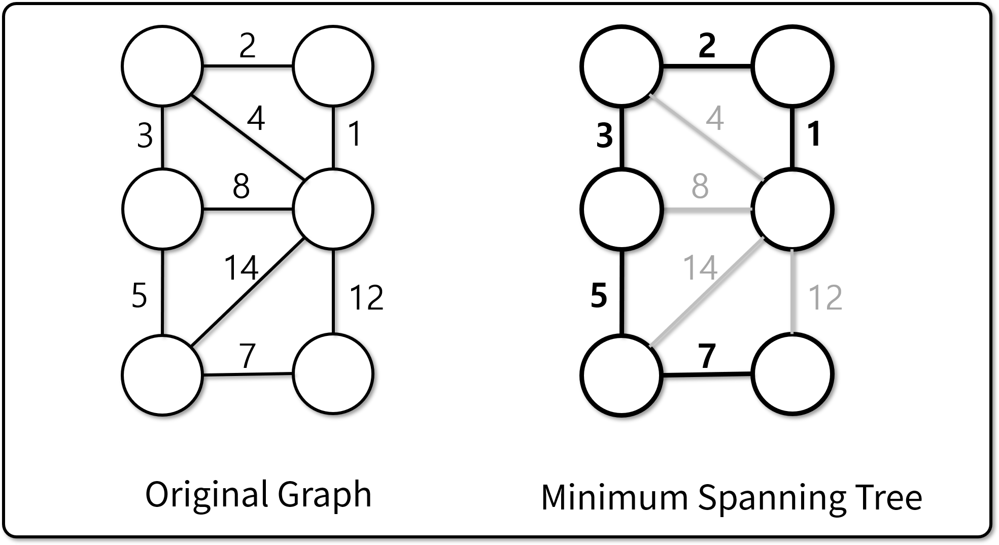
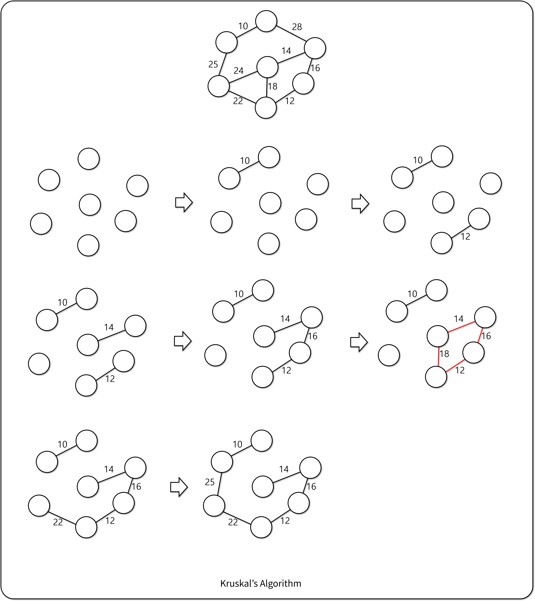
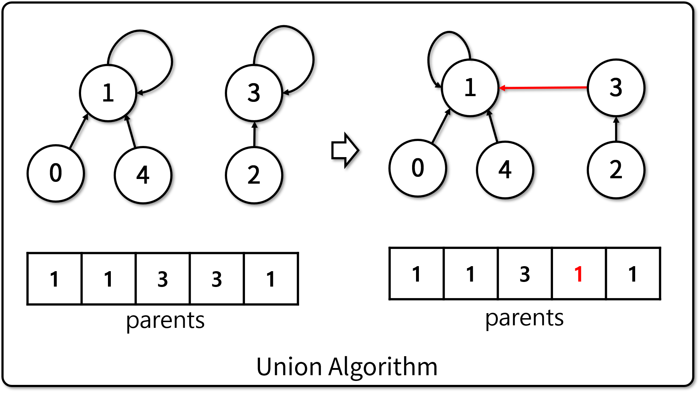
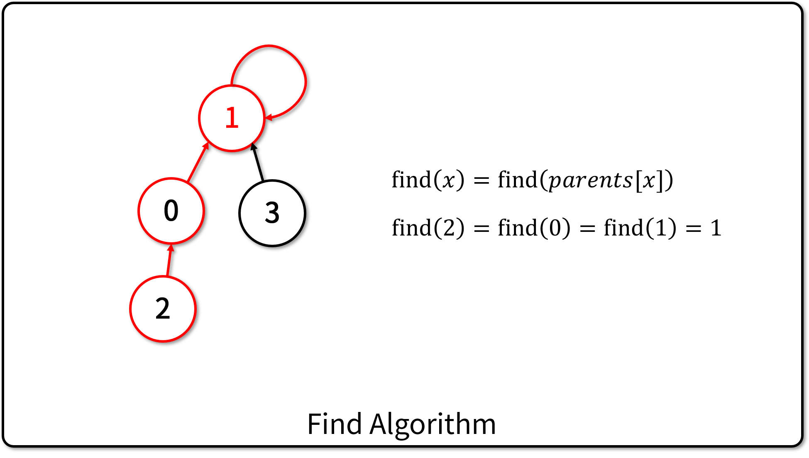
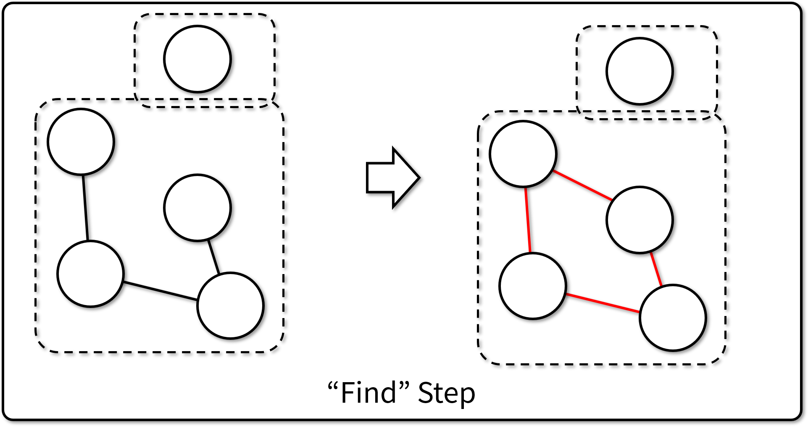

# 최소 신장 트리 (Minimum Spanning Tree)

## 최소 신장 트리

- 어느 그래프의 Subgraph 중, 다음 조건을 만족하는 그래프
  - 본 그래프의 모든 노드를 포함한다.
  - 모든 노드가 서로 연결되어 있다. (Connected graph)
  - 사이클이 존재하지 않는다.
  - 위 조건들을 만족하는 그래프 중 간선 가중치의 합이 최소인 그래프

## 크루스칼 알고리즘 (Kruskal's Algorithm)

- 모든 간선을 가중치를 기준으로 오름차순 정렬 (O(eloge))
- 작은 가중치의 간선부터 하나씩 선택하여 MST를 구성한다.
  - 이 과정에서 사이클을 형성하는 간선은 선택하지 않는다.
  - 사이클 형성을 판단하는 알고리즘은 `Union-Find` 알고리즘

### Union-Find 알고리즘

- 각 노드를 '노드가 하나씩 있는 집합'으로 초기화.
  - 집합은 트리 형태로 구성하며, 각 노드의 부모 노드를 저장
  - 루트 노드의 경우 자기 자신을 부모 노드로 저장
- 간선을 하나 추가할 때 마다, 간선에 의해 연결되는 집합을 '합집합(`Union`)'
  - 간선이 사이클을 형성하는지 알아내기 위해 루트 노드를 찾는(`Find`) 동작 수행
    - 두 집합의 루트 노드가 같으면 사이클이 형성되므로 선택하지 않음

- Union 알고리즘의 구현

출처: https://bowbowbow.tistory.com/26

 - 두 집합의 루트 노드 중 하나가 다른 집합의 루트 노드를 부모로 가지게 한다.

- Find 알고리즘의 구현

출처: https://bowbowbow.tistory.com/26

  - 재귀적으로 부모 노드를 찾아서, 자기 자신이 부모 노드일 경우 반환
  - Path Compression: Find 과정에 참여한 모든 노드의 부모 노드를 루트 노드로 설정

### 크루스칼 알고리즘의 구현

- 참고 코드
  - [기반 소스 코드](src/before.py)
  - [솔루션 코드](src/after.py)
