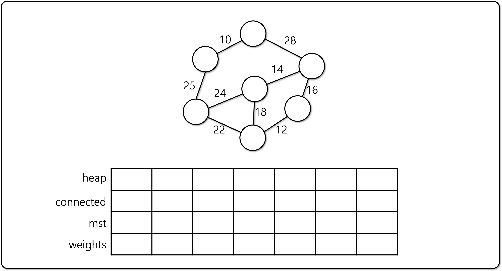

# 프림 알고리즘 (Prim's Algorithm)

## Prim's Algorithm

- 임의의 노드를 하나 선택한다.
- 선택한 노드로부터 가장 낮은 가중치를 갖는 간선으로 이어지는 노드 선택.
  - 이 과정을 모든 노드가 선택될때까지 반복 (`O(V^2)`)
  - 최적화 알고리즘 적용 시 시간복잡도는 `O(ElogV)`
- 프림 알고리즘은 간선이 많을 때, 크루스칼 알고리즘은 간선이 적을 때 사용

## 프림 알고리즘 최적화

- 각 노드가 연결될 때 사용된 가중치를 기억 (Dynamic Programming)
- 선택된 노드의 집합(Conneceted Nodes)를 검사하여 Cycle 발생을 방지
- Min Heap을 이용하여 간선의 가중치를 정렬
  - 노드를 연결할 때 마다, 해당 노드의 모든 간선을 Min Heap에 삽입

### 프림 알고리즘의 구현

- 참고 코드
  - [기반 소스 코드](src/before.py)
  - [솔루션 코드](src/after.py)
